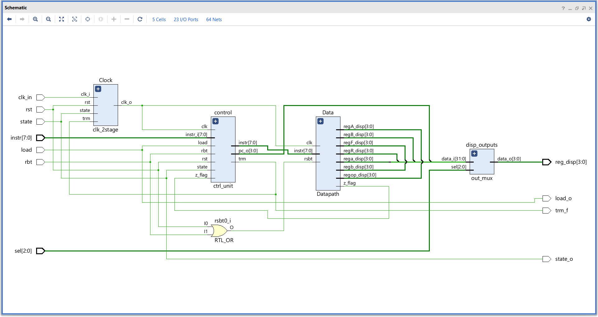
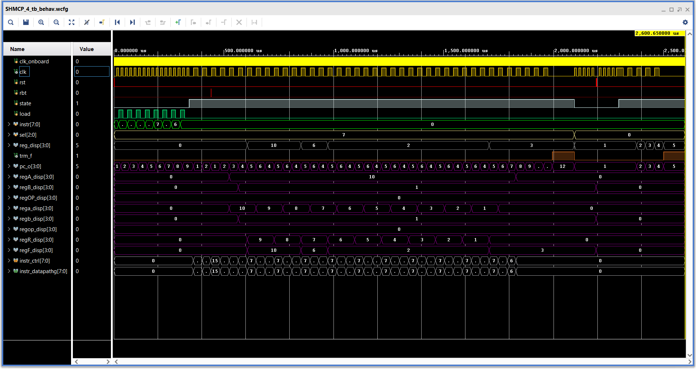
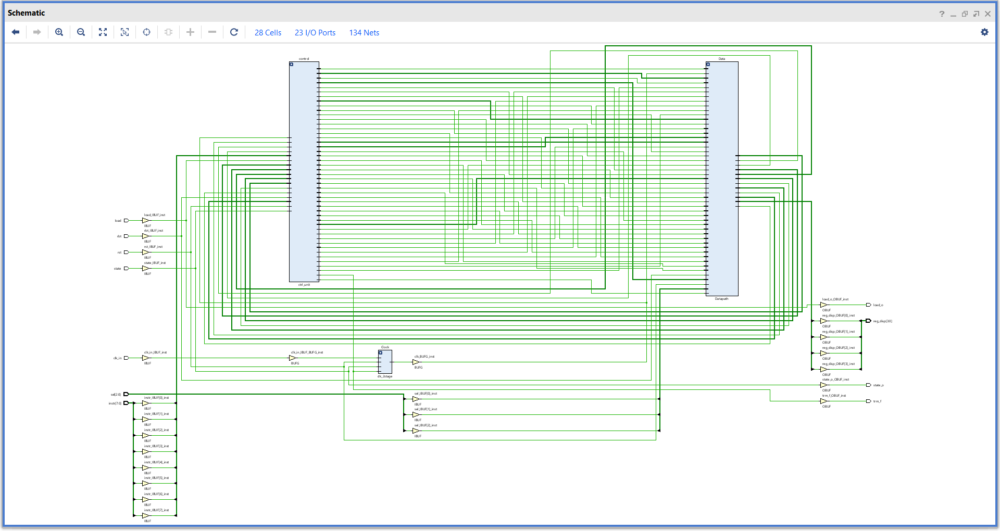
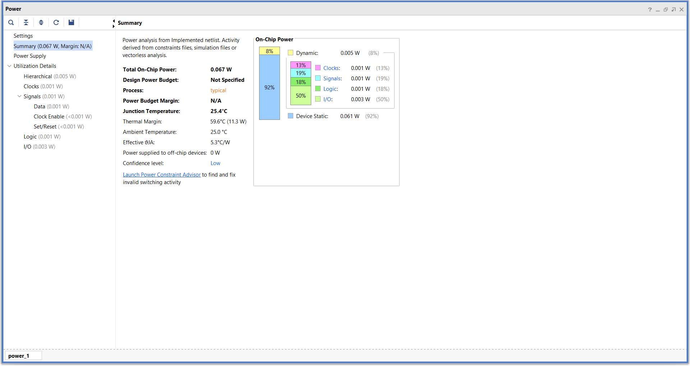
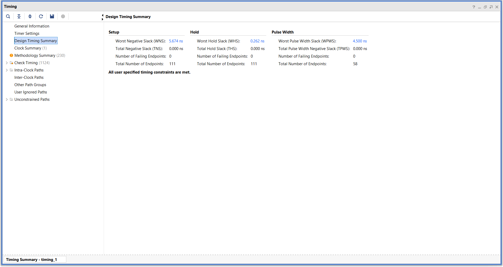
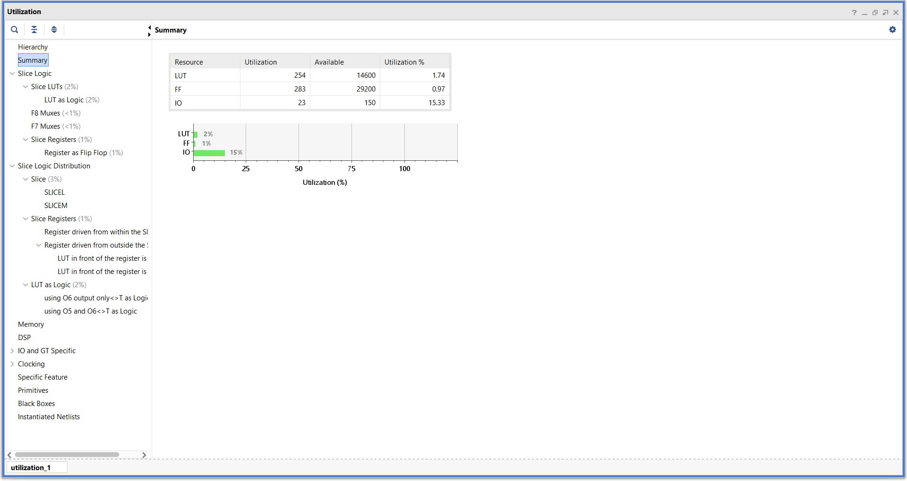

# **Simple Hierarchical MicroCode Processor - 4bit ( SHMCP-4 )**

As the name suggests its a basic microcoded Processor that can run basic programs, i built it to get an basic understanding of computer architecture and it was also fun to design and build.   

---
 
### **Overview :**
- The processor is designed from scratch.
- It operates on 4-bit data.
- Has custom ISA built from ground up to perforom specific operations.
- It follows Harvard architecture.
- The design is built with a hierarchical flow of instructions.
- It is controlled by 8-bit instructions.
- Each bit is given specific function to optimise the instruction set by using as less instructions as possible.
- The full FPGA design is available here,   
    [**SHMCP_4**](https://github.com/ShreyasKombinadka/Simple-Hierarchical-MicroCode-Processor-4bit/tree/main/FPGA/SHMCP_4)  

---

### **Features :**
- 4-bit datapath with Harvard architecture.
- Hierarchical microcode control (3-tier ROM decode).
- Programmable instruction memory (15 locations).
- Data RAM (16 locations, 0-15).
- Complete ALU (7 logic ops + 2 arithmetic).
- Conditional branching (JNZ, J)
- Custom ISA optimized for minimal instruction encoding.

---

### **Progress :**  
- [x] Design
- [x] Building in verilog
- [x] Testing & verification(Vivado)
- [x] Implementation in FPGA board(Spartan-7)

---

### **Results :**
#### **1 Simulation :**   
##### **1.1 Elaborated design**    
  

##### **1.2 Test sequence**
```sv ,
{
    input clk_in, rst,      // Clock and Reset
    input rbt,
    input state,            // State of the CPU
    input load,             // Enable for instruction load
    input [7:0] instr,      // Instruction input
    input [2:0] sel,
    output [3:0] reg_disp,
    output state_o,
    output load_o,
    output trm_f

}

initial clk = 0 ;
always #1 clk = ~clk ;

initial begin

    rst = 1 ; rbt = 0 ;
    state = 0 ; load = 0 ; instr = 0 ; sel = 7;

    repeat(1000) @( negedge clk ) ; rst = 0 ; 
    @( negedge dut.clk ) ; instr = 8'h0F ; load = 1 ;
    @( negedge dut.clk ) ; load = 0 ;
    @( negedge dut.clk ) ; instr = 8'h2A ; load = 1 ;  // 10 -> A
    @( negedge dut.clk ) ; load = 0 ;
    @( negedge dut.clk ) ; instr = 8'h41 ; load = 1 ;  // 1 -> B
    @( negedge dut.clk ) ; load = 0 ;
    @( negedge dut.clk ) ; instr = 8'h0D ; load = 1 ;  // SUB ( A - B )
    @( negedge dut.clk ) ; load = 0 ;
    @( negedge dut.clk ) ; instr = 8'h07 ; load = 1 ;  // R -> X1
    @( negedge dut.clk ) ; load = 0 ;
    @( negedge dut.clk ) ; instr = 8'h34 ; load = 1 ;  // JNZ
    @( negedge dut.clk ) ; load = 0 ;
    @( negedge dut.clk ) ; instr = 8'h06 ; load = 1 ;  // R -> A
    @( negedge dut.clk ) ; load = 0 ;
    @( negedge dut.clk ) ; instr = 8'h00 ; load = 1 ;  // NOP
    @( negedge dut.clk ) ; load = 0 ;
    
    @(negedge dut.clk) ; state = 1 ; load = 0 ; // Run the programm
    repeat(50000) @( negedge clk ) ; rbt = 1 ;
    repeat(1000) @( negedge clk ) ; rbt = 0;
    @(posedge trm_f) ;
    repeat(50000) @( negedge clk ) ; state = 0 ; load = 0 ; instr = 0 ; sel = 0;
    
    repeat(50000) @( negedge clk ) ; rst = 1 ;
    repeat(1000) @( negedge clk ) ; rst = 0; 
    
    repeat(50000) @(negedge clk) ; state = 1;    // Run the programm
    @(posedge trm_f);
    repeat(50000) @(negedge clk) ; state = 0;
    repeat(50000) @(negedge clk) ; state = 1;
    @(posedge trm_f) ;
    repeat(50000) @(negedge clk) ; $finish;

end

```

##### **1.3 Waveform**


#### **2 Implimentation :**
##### **2.1 Schematic**


##### **2.2 Reports :**
###### **2.2.1 Power**

###### **2.2.2 Timing**

###### **2.2.3 Utilization**


---

### **NOTE :**
- This is just a simple model for me to learn stuff so it has many flaws and potential failures but designing and building this was very fun and gave me a deeper insight into the hardware design.
- Also i am building the same design on real hardware using logic IC's on breadboards, its kind of a lagging behind because it takes more time to actually have the design working with real world limitations and problems, so if you wanna check it out heres the link,   
    [**Breadboard-CPU-4bit**](https://github.com/ShreyasKombinadka/Breadboard-CPU-4bit)